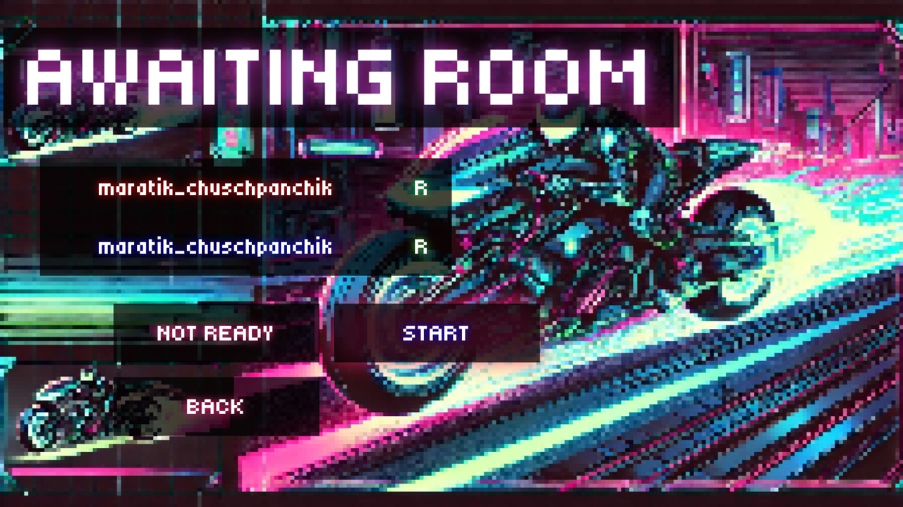
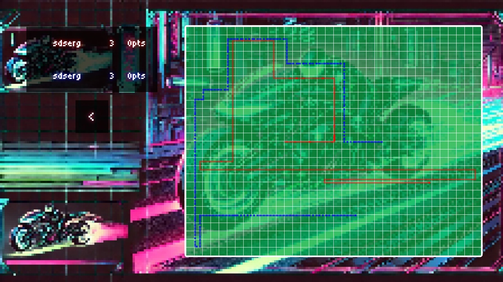

# Игра ТРОН

ТРОН — это аркадная игра для двоих игроков, где каждый управляет змейкой, оставляя за собой стену. Цель игры — прожить дольше противника, избегая столкновений со стенами и маршрутом оппонента, а также создавая ловушки для противника с помощью собственной стены.

В этом проекте мы реализовали игру ТРОН на языке JS

 

 

## Реализация игры ТРОН

Наша реализация игры ТРОН включает создание двумерной сетки, где каждая ячейка представляет собой положение на игровом поле. Змейка игрока представлен серией соединённых ячеек на сетке, которые обновляются при каждом движении. Игра продолжается до тех пор, пока один из игроков не врежется в стену или в маршрут противника, после чего выигрывает другой игрок.

В игре доступны два режима: человек против человека или человек против бота. 

 

 

## Протокол сетевого взаимодействия
Данный протокол описывает процесс взаимодействия клиента и сервера в игровой сессии, включая подключение клиента, перестройку связи и передачу данных.

### 1.Название протокола
UDP

### 2.Описание формата сообщений
Сообщения состоят из двух частей: HEADER и PAYLOAD.
Формат данных PAYLOAD — JSON

Структура сообщения:
HEADER | PAYLOAD

HEADER — заголовок сообщения фиксированной длины. 
PAYLOAD — тело сообщения с данными, описанными в JSON.

Примеры сообщений:
1. AuthentificationMessage:
   
   {
       "playerName": "Player1"
   }
   
2. IPEndPointMessage (REDIRECT от сервера клиенту):
   
   {
       "address": "192.168.1.100",
       "port": 5050
   }
   
3. CONNECT:
   
   {
       "status": "connected"
   }

### 3.Примеры запросов и ответов 
1. Клиент → Сервер: Запрос аутентификации.
   - Заголовок: AUTH
   - Тело:
     
     {
         "playerName": "Player1"
     }
     

2. Сервер → Клиент: Ответ с перенаправлением.
   - Заголовок: REDIRECT
   - Тело:
     
     {
         "address": "192.168.1.101",
         "port": 6060
     }
     

3. Клиент → Сервер: Подтверждение подключения.
   - Заголовок: CONNECT
   - Тело:
     
     {
         "status": "connected"
     }
     

4. Клиент → Сервер: Взаимодействие в игровой сессии (например, ход игрока).
   - Заголовок: MOVE
   - Тело:
     
     {
         "direction": "north"
     }
     

### 4.Описание логики обработки на сервере 

1. Аутентификация клиента:
Сервер получает сообщение с заголовком AUTH.
Проверяет данные клиента из PAYLOAD (например, имя игрока).
Выполняет привязку клиента к потоку или игровому процессу.

2. Перенаправление:
Если сервер определил, что клиенту требуется работать через другое соединение:
Формирует сообщение REDIRECT с новым адресом и портом.
Отправляет его клиенту.

3. Подключение к новому указателю:
После подтверждения перенаправления клиент отправляет серверу сообщение с заголовком CONNECT. Сервер добавляет клиента в активный игровой пул.

4. Игровая логика:
Сервер принимает запросы клиентов (например, движения) с заголовком MOVE.
Проверяет корректность действий: валидность хода, взаимодействие с игровым миром.
Отправляет ответ клиентам с обновлённым состоянием игры.

### 5.Описание логики обработки ошибок

1. Обработка ошибок подключения:
Если клиент не смог отправить сообщение (например, SocketException), то соединение закрывается. Сокет удаляется с вызовом local.Close() и local.Dispose().

2. Таймаут ожидания:
Если клиент не получил ответ от сервера в течение 3000 мс (ReceiveTimeout), соединение считается неуспешным. Сообщение логируется, и попытка подключения завершается.

3. Непредвиденные ошибки протокола:
Если сервер получает сообщение с некорректным HEADER или ошибочной структурой JSON:
Сообщение отбрасывается.
Сервер отправляет сообщение об ошибке

4. Проблема с перенаправлением:
Если сообщение перенаправления (REDIRECT) повреждено или клиент не может подключиться к новому адресу. Клиент прекращает попытки и завершает соединение.

### Структура проекта
1. Проект Tron.Client.Application
Основной клиент для игроков
MainWindow.xaml: Отображает пользовательский интерфейс
ViewModels: Логика представления
Использует библиотеки:
- Tron.Client.Networking для сетевого взаимодействия
- Tron.Common для общих типов данных

2. Проект Tron.Client.Networking
Ключевой компонент протокола клиента
UdpConnector.cs:
Реализация UDP-клиента
Управление сообщениями (Send(), Receive())
Кодирует/декодирует сообщения в соответствии с протоколом

3. Проект Tron.Server
Включает логику обработки сообщений от клиентов:
- Модуль Networking: Слушает и обрабатывает подключения через UDP
- Модуль Core: Логика игры (обработка действий игроков, управление игровым миром)
Использует проект Tron.Common для типов данных

4. Проект Tron.Common
Библиотека общих данных:
Entities: Игровые элементы
Messages: Типы сообщений

Networking: Общие утилиты для работы с сетью.